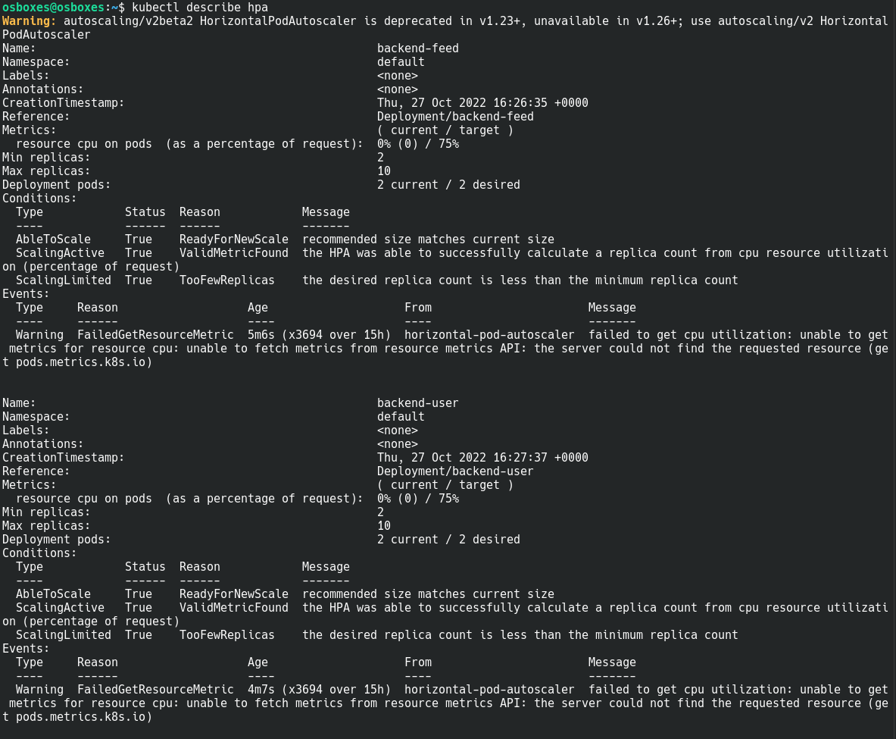
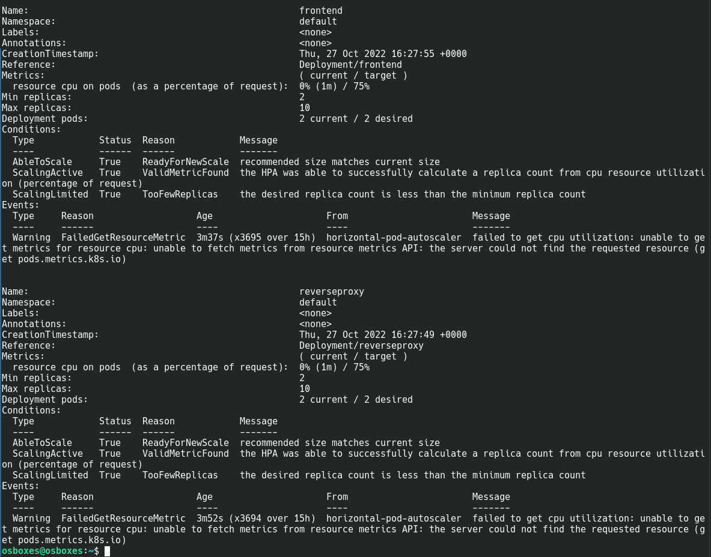
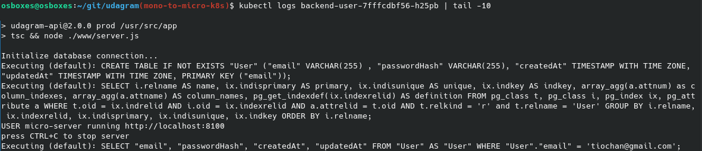

# Screenshots
To help review your infrastructure, please include the following screenshots in this directory::

## Deployment Pipeline
* DockerHub showing containers that you have pushed
  * 
  * 
  * 
  * 
  * 

* GitHub repository’s settings showing your Travis webhook (can be found in Settings - Webhook)
  
  * As I describe in the screenshot below, I could not use travis.org because it didn't allow me to execute builds with my free account because of lack of resources.

  Instead of that I had to use my company's resources: Github enterprise + Travis (integrated with GHE)

  In this setup, I don't see any webhook in my repository. So I paste the integration in Travis that shows the repository name. The other screenshots also demonstrate that travis is building successfully the whole pipeline.

  
  

* Travis CI showing a successful build and deploy job

  * 

  * 

  * 

## Kubernetes
* To verify Kubernetes pods are deployed properly
```bash
kubectl get pods
```
  * 

* To verify Kubernetes services are properly set up
```bash
kubectl describe services
```
  * 

  * 

* To verify that you have horizontal scaling set against CPU usage
```bash
kubectl describe hpa
```

  * 

  * 

* To verify that you have set up logging with a backend application
```bash
kubectl logs {pod_name}
```

  * 

  * 

  * 


# Final result

Worth to share a screenshot of the final result


